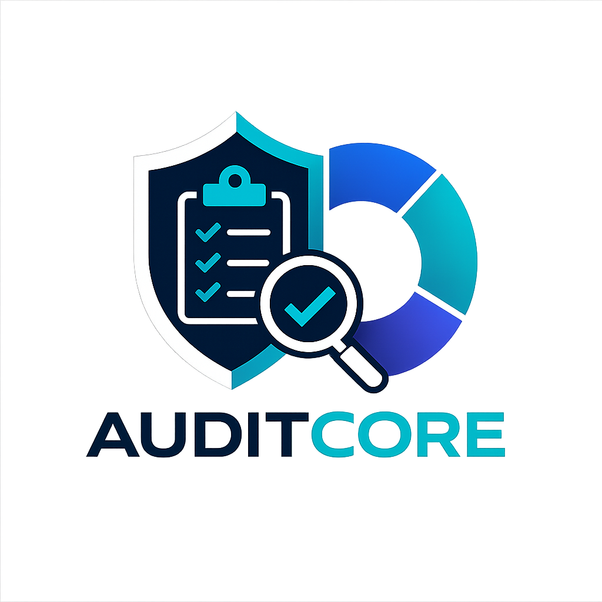

<div align="center">



<br />


### Enterprise IT Audit & Compliance Platform

**Audita. Evalúa. Protege.**


</div>

---

## 📌 Descripción

**AuditCore** es una plataforma web orientada a la gestión integral de auditorías de Tecnologías de la Información, cumplimiento, riesgos, evidencias, hallazgos y planes de acción.

El proyecto nace como una reconstrucción moderna de una experiencia académica de la asignatura **Auditoría Informática (SOF-009)** del Instituto Tecnológico de Las Américas (ITLA), cursada durante el período **2017-C2**.

La materia fue principalmente teórica. Sin embargo, la exposición realizada como proyecto final sirvió como base conceptual para transformar aquellos contenidos en una aplicación profesional, escalable y preparada para evolucionar a producto comercial.

> 💡 La idea de convertir aquel proyecto académico en una plataforma de software moderna fue concebida por **Francis Jairo Matías Rosario**.

---

## 🎓 Contexto académico

| Dato | Información |
|---|---|
| 🏫 Institución | Instituto Tecnológico de Las Américas (ITLA) |
| 📖 Asignatura | Auditoría Informática (SOF-009) |
| 👨‍🏫 Profesor | Simeon Clase Ulloa |
| 📅 Período académico | 2017-C2 |
| 📚 Naturaleza de la materia | Teórica |
| 🧩 Base conceptual | Exposición final sobre COBIT y administración de datos |
| 💡 Idea de reconstrucción | Francis Jairo Matías Rosario |

---

## 👥 Integrantes del grupo original

| Nombre completo | Matrícula |
|---|---|
| 👩‍🎓 **Sianya Jesuína Castillo Perez** | 2015-2734 |
| 👨‍🎓 **Sinver Vladimir Aguiló Flores** | 2015-2872 |
| 👩‍🎓 **Leidy Jireth Medina Oleaga** | 2015-2942 |
| 👨‍💻 **Francis Jairo Matías Rosario** | 2015-2984 |
| 👨‍🎓 **Pedro Arturo de León Parra** | 2015-3018 |
| 👩‍🎓 **Yeidy Khris Utate Utate** | 2015-3143 |

> El grupo participó en la exposición académica original. La reconstrucción moderna de AuditCore corresponde a una iniciativa posterior desarrollada por Francis Jairo Matías Rosario.

---

## 🎯 Objetivo general

Desarrollar una plataforma profesional para planificar, ejecutar, documentar y dar seguimiento a auditorías de TI, permitiendo evaluar controles, identificar riesgos, registrar evidencias, gestionar hallazgos y generar reportes ejecutivos y técnicos.

---

## 🚀 Funcionalidades previstas

- 📊 Dashboard ejecutivo
- 🏢 Gestión de organizaciones, sucursales y departamentos
- 👥 Usuarios, roles y permisos
- 🔐 Autenticación JWT y sesiones seguras
- 📋 Planificación y ejecución de auditorías
- 🧭 Gestión de marcos de control
- ✅ Checklists y evaluaciones
- 📁 Evidencias documentales
- ⚠️ Gestión de riesgos
- 🔎 Registro de hallazgos
- 🛠️ Planes de acción y seguimiento
- 📈 Indicadores de cumplimiento
- 📄 Reportes PDF y Excel
- 🔔 Notificaciones y alertas
- ☁️ Preparación para Azure y AWS

---

## 🧩 Marcos y estándares previstos

AuditCore estará diseñado para soportar múltiples marcos y buenas prácticas, entre ellos:

- COBIT
- ISO/IEC 27001
- NIST Cybersecurity Framework
- CIS Controls
- ITIL
- Marcos internos personalizados

COBIT será el primer marco de referencia incorporado, por su relación directa con la exposición académica que inspiró el proyecto.

---

## 🛠️ Stack tecnológico

### Backend

<p>
  
  
  
</p>

- ASP.NET Core Web API
- C#
- Entity Framework Core
- SQL Server
- JWT Bearer Authentication
- Swagger / OpenAPI
- xUnit

### Frontend

<p>
  
</p>

- React
- TypeScript
- Vite
- React Router
- TanStack Query
- Axios
- React Hook Form
- Zod
- Recharts
- Lucide React

### Arquitectura e infraestructura

<p>
  
</p>

- Clean Architecture
- Principios SOLID
- Docker
- Docker Compose
- Git y GitHub
- Azure Ready
- AWS Ready

---

## 🏗️ Arquitectura

```text
AuditCore/
├── backend/
│   ├── AuditCore.slnx
│   ├── src/
│   │   ├── AuditCore.Domain/
│   │   ├── AuditCore.Application/
│   │   ├── AuditCore.Infrastructure/
│   │   └── AuditCore.Api/
│   └── tests/
│       ├── AuditCore.Domain.Tests/
│       └── AuditCore.Application.Tests/
│
└── frontend/
    └── auditcore-web/
```

Regla de dependencias:

```text
Domain ← Application ← Infrastructure ← API
```

- **Domain:** entidades, reglas de negocio, value objects y eventos de dominio.
- **Application:** casos de uso, contratos, validaciones y DTOs.
- **Infrastructure:** persistencia, EF Core, SQL Server y servicios externos.
- **API:** endpoints, autenticación, middleware, Swagger y composición.
- **Frontend:** interfaz React desacoplada y desplegable de forma independiente.

---

## 🔐 Seguridad prevista

- Access tokens JWT de corta duración
- Refresh tokens rotativos
- Autorización basada en roles y permisos
- Protección multiempresa
- Validación centralizada
- Rate limiting
- Auditoría de acciones
- Cifrado en tránsito y en reposo
- Gestión segura de secretos
- Validación de archivos y evidencias
- Registro de sesiones y accesos

---

## 📦 Estado actual

El proyecto se encuentra en fase de construcción inicial.

- ✅ Solución backend creada
- ✅ Proyectos de Clean Architecture configurados
- ✅ Swagger funcionando
- ✅ Compilación backend sin errores ni advertencias
- ✅ Proyecto frontend React + TypeScript creado
- 🚧 Autenticación pendiente
- 🚧 Base de datos pendiente
- 🚧 Módulos funcionales pendientes

---

## 🗺️ Roadmap

### Fase 1 — Fundación técnica

- Arquitectura backend
- Proyecto frontend
- Convenciones de código
- Swagger
- Pruebas base

### Fase 2 — Identidad y acceso

- Usuarios
- Roles
- Permisos
- JWT
- Refresh tokens

### Fase 3 — Organizaciones

- Empresas
- Sucursales
- Departamentos
- Separación multiempresa

### Fase 4 — Motor de auditoría

- Marcos
- Dominios
- Controles
- Preguntas
- Evaluaciones

### Fase 5 — Gestión de resultados

- Evidencias
- Hallazgos
- Riesgos
- Recomendaciones
- Planes de acción

### Fase 6 — Reportes y producción

- Dashboard
- PDF
- Excel
- Docker
- CI/CD
- Azure / AWS

---

## ▶️ Ejecución local

### Backend

```powershell
cd backend
dotnet restore .\AuditCore.slnx
dotnet build .\AuditCore.slnx
dotnet run --project .\src\AuditCore.Api\AuditCore.Api.csproj
```

Swagger estará disponible en una URL similar a:

```text
http://localhost:5047/swagger
```

### Frontend

```powershell
cd frontend\auditcore-web
npm install
npm run dev
```

La aplicación estará disponible en:

```text
http://localhost:5173
```

---

## 📚 Origen académico y evolución

AuditCore no fue un programa desarrollado originalmente en 2017. La asignatura **Auditoría Informática** fue impartida de forma teórica y el grupo realizó una exposición como proyecto final.

Años después, Francis Jairo Matías Rosario retomó aquella experiencia y propuso convertirla en una plataforma real de auditoría de TI, aplicando tecnologías modernas, Clean Architecture y estándares de desarrollo profesional.

Este repositorio conserva el valor histórico de la experiencia académica, pero representa una reconstrucción completamente nueva a nivel de software, arquitectura, diseño y visión de producto.

---

## 👨‍💻 Autor de la reconstrucción

**Francis Jairo Matías Rosario**  
Tecnólogo en Desarrollo de Software — ITLA  
Estudiante de Ingeniería de Software — UNAPEC

[](https://github.com/Jairo0811)

---

## 📄 Licencia

La licencia del proyecto será definida cuando el alcance funcional y la estrategia de publicación estén establecidos.

---

<div align="center">

**AuditCore — Audita. Evalúa. Protege.**

</div>
