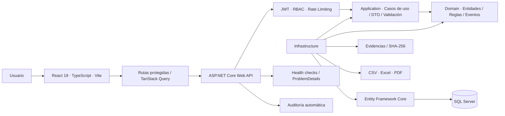
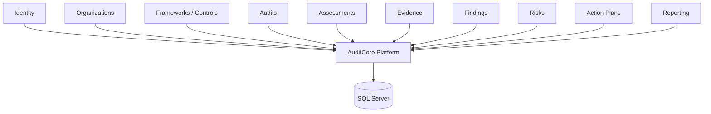
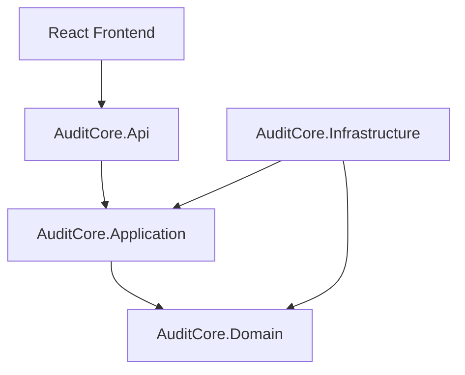
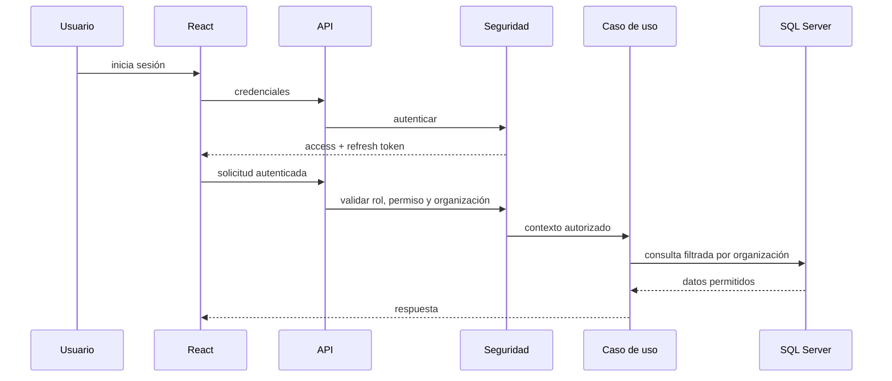

# Arquitectura de AuditCore

AuditCore está implementado como un **monolito modular full stack** apoyado en **Clean Architecture**. La solución se despliega como una sola plataforma, pero cada capacidad de negocio mantiene límites explícitos para reducir acoplamiento, preservar el aislamiento multiempresa y permitir una evolución segura.

## Vista general



La regla estructural principal es que el dominio no conoce detalles de infraestructura. La API actúa como **composition root**, Application coordina los casos de uso e Infrastructure implementa persistencia, servicios técnicos y adaptadores externos.

## Principios

- Organización por dominio, no únicamente por tipo técnico.
- Dependencias dirigidas hacia el dominio.
- Comunicación entre módulos mediante contratos explícitos.
- Persistencia y servicios externos aislados en Infrastructure.
- API utilizada como composition root.
- Sin referencias directas entre infraestructuras de módulos.
- Shared Kernel pequeño y estable.
- Aislamiento multiempresa aplicado desde el contexto autenticado.

## Módulos funcionales



| Módulo | Responsabilidad |
|---|---|
| Identity | Usuarios, roles, permisos, sesiones y autenticación |
| Organizations | Empresas, sucursales, departamentos y aislamiento multiempresa |
| Frameworks | Marcos, controles y catálogos de cumplimiento |
| Audits | Planificación, alcance, ejecución y ciclo de vida de auditorías |
| Assessments | Controles, preguntas, checklists, evaluaciones y respuestas |
| Evidence | Evidencias, archivos, metadatos, hashes y trazabilidad |
| Findings | Hallazgos, recomendaciones, responsables y estados |
| Risks | Riesgos, impacto, probabilidad, tratamiento y seguimiento |
| ActionPlans | Acciones correctivas, fechas, responsables y verificación |
| Reporting | Dashboard, indicadores y exportaciones CSV/Excel/PDF |

## Capas

La solución mantiene cuatro ensamblados principales:

```text
AuditCore.Domain
AuditCore.Application
AuditCore.Infrastructure
AuditCore.Api
```

Responsabilidades:

- **Domain:** entidades, reglas de negocio, value objects y eventos.
- **Application:** casos de uso, DTO, contratos, validadores y orquestación.
- **Infrastructure:** EF Core, SQL Server, repositorios, evidencias, reportes y servicios técnicos.
- **API:** endpoints, autenticación, autorización, middleware, OpenAPI y composition root.
- **Frontend:** React modular, rutas protegidas, estado remoto y experiencia de usuario.

## Regla de dependencias



- Domain no depende de ninguna otra capa.
- Application solo depende de Domain.
- Infrastructure implementa contratos definidos por Application y utiliza Domain.
- API compone módulos, middleware, seguridad y endpoints.
- El frontend consume exclusivamente contratos HTTP publicados por la API.

## Seguridad multiempresa



El cliente nunca se considera fuente confiable del tenant. La organización y los permisos efectivos se obtienen del contexto autenticado y vuelven a validarse en backend.

## Composition root

`AuditCore.Api` es el único punto autorizado para componer la aplicación. Desde `Program` se registran controladores, OpenAPI, autenticación, autorización, módulos, persistencia, servicios técnicos, rate limiting y health checks.

## Comunicación entre módulos

Se utilizan, en orden de preferencia:

1. Contratos de Application.
2. Servicios de dominio o aplicación con límites explícitos.
3. Eventos cuando una operación requiera desacoplamiento.
4. Consultas de solo lectura diseñadas específicamente para reporting.

Un módulo no debe acceder directamente a repositorios o detalles internos de otro módulo.

## Criterio de evolución

La arquitectura conserva la simplicidad operativa de un monolito y evita adoptar microservicios antes de que existan necesidades reales de escalado o despliegue independiente. Un módulo solo debería extraerse si aparecen límites operativos, de propiedad o de escalabilidad suficientemente claros.
